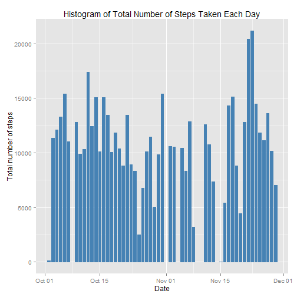
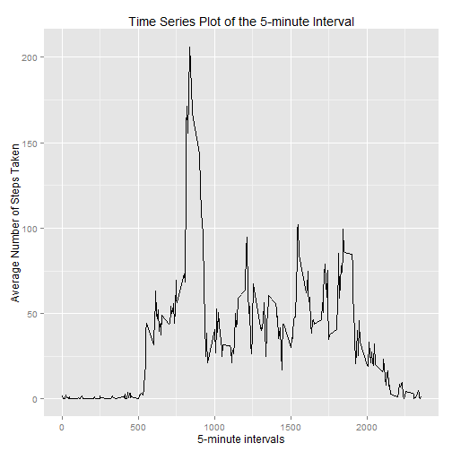
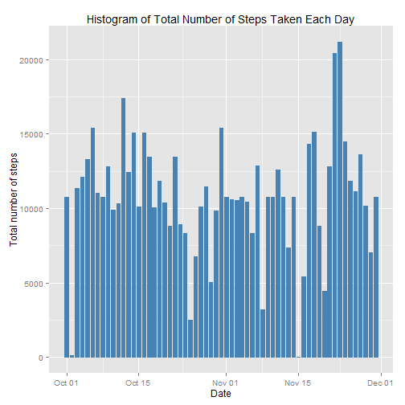
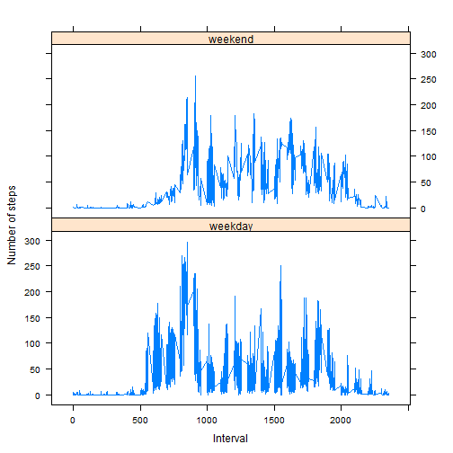

R Markdown Assignment - Peer Assessment 1
 - By Robert Adams
======================================

Let's first read the data into R using the directory path to where we saved the data. It is a CSV format so we use read.csv.


```r
path <- "C:/Users/Bobby/Google Drive/Data Science/Data Sets/activity.csv"
Data <- read.csv(file.path(path), header=T, sep=",", stringsAsFactors=FALSE)
```

Let's look at the head of the data to make sure it loaded in correctly


```r
head(Data)
```

```
##   steps       date interval
## 1    NA 2012-10-01        0
## 2    NA 2012-10-01        5
## 3    NA 2012-10-01       10
## 4    NA 2012-10-01       15
## 5    NA 2012-10-01       20
## 6    NA 2012-10-01       25
```

Next we're going to omit the N/A data, as it is useless in this analysis


```r
Data <- na.omit(Data)
```

Now we set the date variable as a date class


```r
Data$date <- as.Date(Data$date)
```

Now we load the ggplot 2 package and plot the histogram for Number of Steps by date


```r
library(ggplot2)
```

```
## Warning: package 'ggplot2' was built under R version 3.2.1
```

```r
g <- ggplot(Data, aes(Data$date, Data$steps))
g + geom_bar(stat="identity", colour = "steelblue", fill = "steelblue", width = 0.7) +
labs(title = "Histogram of Total Number of Steps Taken Each Day", x = "Date", y = "Total number of steps")
```

 

In order to report the mean steps by day we need to aggregate the data:


```r
Data1 <- aggregate(Data$steps~Data$date, FUN="mean")
```

and to report the median we do calculate the total number of steps for the day, then turn it into the median:


```r
Data2 <- aggregate(Data$steps~Data$date, FUN="sum")
median(Data2$`Data$steps`)
```

```
## [1] 10765
```

Now for a time series plot, averaged steps across all days in a time series plot for the 5 minute intervals.


```r
Data3 <- aggregate(Data$steps~Data$interval, FUN="mean")
g <- ggplot(Data3, aes(Data3$`Data$interval`, Data3$`Data$steps`))
g + geom_line() +labs(title = "Time Series Plot of the 5-minute Interval", x = "5-minute intervals", y = "Average Number of Steps Taken")
```

 

Which 5-minute interval, on average across all the days in the dataset, contains the maximum number of steps?


```r
Data3[Data3$`Data$steps` == max(Data3$`Data$steps`), ]
```

```
##     Data$interval Data$steps
## 104           835   206.1698
```

Due to biases in calculation, we should look for N/A values in out data set, so let's start fresh again and see the summary of steps for the number of N/A rows


```r
Data <- read.csv(file.path(path), header=T, sep=",", stringsAsFactors=FALSE)
summary(Data$steps)
```

```
##    Min. 1st Qu.  Median    Mean 3rd Qu.    Max.    NA's 
##    0.00    0.00    0.00   37.38   12.00  806.00    2304
```

Let's calculate the number of N/A values


```r
sum(is.na(Data))
```

```
## [1] 2304
```

The following for loop loofs for i in 1 to the length of the data, and for each row it checks if it is an N/A value on steps, if it is then it replaces the steps data with the mean of that interval, taken from the previously aggregated mean data.


```r
for (i in 1:nrow(Data)){
        if(is.na(Data$steps[i])){
                Data$steps[i] <- Data3[which(Data$interval[i]==Data3$`Data$interval`),]$`Data$steps`
        }
}

sum(is.na(Data))
```

```
## [1] 0
```

Next we plot the new data with the N/A's filled in:


```r
Data$date <- as.Date(Data$date)
g <- ggplot(Data, aes(Data$date, Data$steps))
g + geom_bar(stat="identity", colour = "steelblue", fill = "steelblue", width = 0.7) +
        labs(title = "Histogram of Total Number of Steps Taken Each Day", x = "Date", y = "Total number of steps")
```

 

Then from this new data we take the new mean and median from a newly made aggregate.


```r
NewData <- aggregate(Data$steps, list(Data$date), FUN="sum")

mean(NewData$x)
```

```
## [1] 10766.19
```

```r
median(NewData$x)
```

```
## [1] 10766.19
```

The above values are from the newly filled N/A data, what if we compare this new mean/median to the old data's mean/median. As you can see from the values below, the means for the data are the same, but the median for the new data has been shifted up by 1.19 steps.


```r
mean(NewData$x)-mean(Data2$`Data$steps`)
```

```
## [1] 0
```

```r
median(NewData$x)-median(Data2$`Data$steps`)
```

```
## [1] 1.188679
```

The code below turns date into a date format, then assigns the days to day names (Monday, Tuesday etc), it then assigns it to a column in our data frame and applies a levels command to change the levels to assign the days to a weekday or a weekend day.


```r
Data$date <- as.Date(Data$date)
day <- weekdays(Data$date)
Data$day <- day
levels(Data$day) <- list(weekday=c("Monday", "Tuesday", "Wednesday", "Thursday", "Friday"), weekend=c("Saturday", "Sunday"))
```

Now we can assign the names of the weekend/weekdays through a really inefficient method and use a lattice time series to plot it.


```r
FinalHist <- aggregate(Data$steps,list(Data$day,Data$interval), FUN="mean")

FinalHist$Group.1[FinalHist$Group.1=="Monday"] <- "weekday"
FinalHist$Group.1[FinalHist$Group.1=="Tuesday"] <- "weekday"
FinalHist$Group.1[FinalHist$Group.1=="Wednesday"] <- "weekday"
FinalHist$Group.1[FinalHist$Group.1=="Thursday"] <- "weekday"
FinalHist$Group.1[FinalHist$Group.1=="Friday"] <- "weekday"

FinalHist$Group.1[FinalHist$Group.1=="Saturday"] <- "weekend"
FinalHist$Group.1[FinalHist$Group.1=="Sunday"] <- "weekend"

library(lattice)
```

```
## Warning: package 'lattice' was built under R version 3.2.1
```

```r
xyplot(FinalHist$x ~ FinalHist$Group.2 | FinalHist$Group.1, 
       layout = c(1, 2), type = "l", 
       xlab = "Interval", ylab = "Number of steps")
```

 

